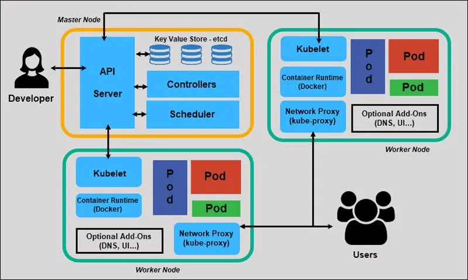

# KCNA Certification Study Materials

This folder contains my personal study notes for the **Kubernetes and Cloud Native Associate (KCNA)** certification.  
It focuses on **hands-on learning**, breaking down concepts into small projects, key term summaries, and practice questions.

---

## 💡 Why This Exists
I built this folder to **document what I learned, not just memorize it**.  
By translating study material into my own words and simple projects, I turned theory into confidence — something that directly improves both interviews and real-world troubleshooting.

I originally planned to take the CKA earlier this year but decided I needed to work on the most important part first. 

The fundamentals - which is why I have included KCNA within this repo.

I used two main materials to prepare:
- **Udemy Course & Practice Tests** by James Spurin
- **"Becoming KCNA Certified"** by Dmitry Galkin

**Resources:**
- [Becoming KCNA Certified GitHub](https://github.com/PacktPublishing/Becoming-KCNA-Certified)
- [Udemy KCNA Course](https://udemy.com/course/dive-into-cloud-native-containers-kubernetes-and-the-kcna/)

> **Note:** I am not affiliated with either resource — these are just what worked for me.

Each section below reflects my own notes, explanations, and examples derived from official CNCF and Kubernetes documentation.

---

Image taken from: https://www.qovery.com/blog/what-is-kubernetes

---

## 📂 Contents

This folder contains three main resources to help you prepare for the KCNA exam:

| File | Description |
|------|-------------|
| [`Kubernetes_Basics_Project.md`](./Kubernetes_Basics_Project.md) | Two beginner-friendly Kubernetes projects using Minikube — from single Pods to Deployments with persistent storage. Get hands-on experience with real YAML manifests and kubectl commands. |
| [`Common_Terms_Glossary.md`](./Common_Terms_Glossary.md) | A clean glossary of 20+ essential Kubernetes and Cloud-Native terms, organized by category. Perfect for quick reference during study sessions. |
| [`Practice_Questions.md`](./Practice_Questions.md) | A collection of KCNA-level practice questions with answers, organized by topic. Test your knowledge on core concepts, networking, controllers, and more. |

---

